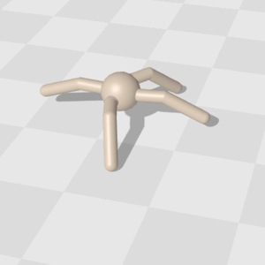

<Toc />

---
hideInToc: true
---

## 期待値を推定したい

- 遷移確率$P$はわからないが，$P$からのサンプルは得られる状況を考えてみよう．\
多くのシミュレータを利用した設定がこの状況に該当する．
- どうすれば$P$を推定できるだろうか？

<figure style="position: absolute; top: 3%; left: 80%; width: 130px; text-align: center;">
  
  <figcaption style="position: absolute; top: 100%; left: -10%; font-size: 0.8em; word-wrap: break-word; text-align: center; width: 130%">

  [Brax](https://github.com/google/brax)より引用．
  </figcaption>
</figure>

 

🤔 次状態のサンプルの標本平均を使って$P$を推定してみよう．

1. 各$(s, a)\in \mathcal{S}\times\mathcal{A}$に対して，シミュレータから次状態$s'$を$N$個サンプルする．$(s'_1, s'_2, \ldots, s'_N)$
2. 集めたサンプルで「$(s, a)$から$s'$への遷移確率」を推定する：
$$
\widehat{P}(s' \rvert s, a) = \frac{1}{N} \sum_{i=1}^N \mathbb{I}[s'=s'_i]
$$

このとき，$\mathbb{E}[\widehat{P}]=P$の意味で，$\widehat{P}$は$P$の不偏推定量．

---

次回扱うが，このように「推定した$\hat{P}$を使って$\pi^\star$を求める手法」を**モデルベース強化学習**と呼ぶ．

ところで...
- 🤔 $P$は推定できそうだが，どれくらいのサンプル数$N$があれば$P$を推定できるだろうか？
- 🤔 最終目標は$\pi^\star$を求めることなので，サンプル数$N$が$\pi^\star$の計算にどれくらい影響するかも気になる...

$N$が$\pi^\star$の計算に与える影響を評価するために，今回は**基本的な確率論の道具**を紹介する．

 
 

👨‍🏫 後に見るHoeffdingの不等式やUnion Boundを省略して説明することも考えた．

しかし，講義後半の「探索」についての内容を説明するために確率論の道具がどうしても必要になる...

これらは強化学習以外でも非常に重要な道具なので，ぜひこの機会に理解しておいてほしい．

---

## 大数の法則

まず，$N$を増やすと標本平均が母平均に収束することを確認しよう．
最も簡単な**大数の弱法則**を紹介する．[1]

**補題（大数の弱法則）**：$X_1, X_2, \ldots, X_N$を平均$\mu$かつ分散$\sigma^2$の独立同分布な確率変数とする．\
$\hat{\mu}_N = \frac{1}{N}\sum_{i=1}^N X_i$とおくと，$\hat{\mu}_N$ が $\mu$ から $\epsilon$ 以上ずれる確率が $N\to\infty$ で $0$ に収束する.[1] つまり，
$$
\forall \epsilon > 0, \quad \lim_{N\to\infty} \mathbb{P}\left(\left|\hat{\mu}_N - \mu\right| > \epsilon\right) = 0
$$

**証明**：独立同分布な確率変数の平均と分散は$\mathbb{E}[\hat{\mu}_N] = \mu$と$\operatorname{Var}[\hat{\mu}_N] = \frac{\sigma^2}{N}$．Chebyshevの不等式[2]を使うと，

$$
\mathbb{P}(|\hat{\mu}_N-\mu| \geq \epsilon) \leq \frac{\operatorname{Var}[\hat{\mu}_N]}{\epsilon^2} = \frac{\sigma^2}{N\epsilon^2}
$$
両辺$N\to\infty$で極限を取ると，右辺は$0$に収束する．

[1] これは「確率変数$\hat{\mu}_N$が$\mu$に**確率収束**する」という．もっと強い**概収束**を示した**大数の強法則**もあるが，講義中では後に出てくるHoeffdingの不等式しか使わないので，強法則は扱わない．詳しくは[WIIS](https://wiis.info/math/probability/asymptotic-theory/kolmogorovs-strong-law-of-large-numbers/)などを参照．強法則の簡単な証明は[An elementary proof of the strong law of large numbers](https://link.springer.com/article/10.1007/BF01013465)を参照．\
[2]Chebyshevの不等式： $\mathbb{P}(|X-\mathbb{E}[X]| \geq \epsilon) \leq \frac{\operatorname{Var}[X]}{\epsilon^2}$

---

## 中心極限定理

大数の法則は「標本平均$\hat{\mu}_N$が母平均$\mu$に収束する」ことを保証する．
しかし，「どれくらいの速さで$S_N-\mu$が$0$に近づくのか？」はわからない．
これを調べるために，**中心極限定理**を紹介する．証明は省略．

**補題（中心極限定理）**：$X_1, X_2, \ldots, X_N$を平均$\mu$かつ分散$\sigma^2$の独立同分布な確率変数とする．\
その総和と正規化された総和を
$$
S_N \coloneqq \sum_{i=1}^N X_i
\quad\text{ および }\quad Z_N \coloneqq \frac{S_N-\mathbb{E}[S_N]}{\sqrt{\operatorname{Var}(S_N)}} = \frac{1}{\sigma\sqrt{N}}\sum_{i=1}^N (X_i-\mu)
$$
とおくと，正規化された総和$Z_N$は，$N$が大きくなると標準正規分布に近づく（分布収束する1）．
$$
Z_N = \frac{1}{\sigma\sqrt{N}}\sum_{i=1}^N (X_i-\mu) \xrightarrow{d} \mathcal{N}(0, 1)
$$

[1] 確率変数の列$X_1, X_2, \ldots: \Omega \to \mathbb{R}$が確率変数$X: \Omega \to \mathbb{R}$に**分布収束**するとは，任意の連続点$x \in \mathbb{R}$に対して$\lim_{N\to\infty} \mathbb{P}(X_N \leq x) = \mathbb{P}(X \leq x)$が成り立つことを意味する．詳しくは[WIIS](https://wiis.info/math/probability/asymptotic-theory/convergence-in-distribution-of-sequence-of-random-variables/)を参照．簡単に言えば，$X_N$の確率分布が$X$の確率分布に近づくことを意味する．

---

**使用例**：中心極限定理を使って，標本平均による遷移確率の推定$\widehat{P}$の推定精度を評価しよう．

遷移$(s, a)\to s'$について，$N$個のサンプルを使った遷移確率の推定誤差を$X_N$とする[1]：
$$
X_N \coloneqq \widehat{P}(s' \rvert s, a) - P(s' \rvert s, a) = \frac{1}{N} \sum_{i=1}^N \mathbb{I}[s'=s'_i] - P(s' \rvert s, a)
$$

中心極限定理より[1]，$N$が十分大きいとき
$$
\sqrt{N}\,X_N = \sqrt{N}\bigl(\widehat{P}(s'\rvert s,a)-P(s'\rvert s,a)\bigr) \xrightarrow{d} \mathcal{N}\bigl(0,\;P(s'\rvert s,a)(1-P(s'\rvert s,a))\bigr).
$$
したがって，$\hat{P}(s'\rvert s,a)-P(s'\rvert s,a)$は$\mathcal{N}(0,\;P(s'\rvert s,a)(1-P(s'\rvert s,a))/N)$に従うと近似できる．正規分布表を使って，95%信頼区間を作ると，次のように書ける：
$$
\widehat{P}(s'\rvert s,a) \approx P(s'\rvert s,a) \pm z\sqrt{\frac{P(s'\rvert s,a)(1-P(s'\rvert s,a))}{N}}  \quad \text{ここで } z \approx 1.96
$$

[1] これは，$\mathbb{I}[s'=s'_i]$が独立同分布のベルヌーイ確率変数（成功確率$P(s'\rvert s,a)$）とみなせるので，中心極限定理を適用できる．

---

## Hoeffdingの不等式

中心極限定理は$S_N = X_1 + \cdots + X_N$ を近似して推定する手法．\
しかし，これは「十分大きい$N$」で成り立つ近似であり，小さい$N$のときは精度が落ちる．

🤔 例えば実世界の少ないデータで何かを推定しようとしたときに困る... 強化学習ではよくあること．

そこで，これ以降の講義では次の**Hoeffdingの不等式**を頻繁に使う．

 

**補題（Hoeffdingの不等式）**：$X_1, X_2, \ldots, X_N$を平均$\mu$の独立な確率変数とし，$X_i-\mu$が$\sigma$-subgaussianであるとする．Subgaussian変数は次ページで説明するが，簡単には「$X_i$の分布の裾が平均$\mu$の周りで急速に減少する」ことを意味する．

$\hat{\mu}_N = \frac{1}{N}\sum_{i=1}^N X_i$を標本平均とする．このとき，任意の$\varepsilon > 0$に対して
$$
\mathbb{P}(|\hat{\mu}_N - \mu| \geq \varepsilon) \leq 2\exp\left(-\frac{N\varepsilon^2}{2\sigma^2}\right)
$$

---

## 証明の準備：Subgaussian変数

**定義（Subgaussian変数）**：平均0の確率変数$X$が$\sigma$-subgaussianであるとは，任意の$\lambda \in \mathbb{R}$に対して

$$
\mathbb{E}[\exp(\lambda X)] \leq \exp\left(\frac{\sigma^2\lambda^2}{2}\right)
$$

👨‍🏫 subgaussianな$X$は，極端に大きな値をほぼ出さないことを意味するよ．
実際，次の関係が成り立つ．

**補題（Subgaussianの裾）** 平均0の確率変数$X$が$\sigma$-subgaussianであるとき，次が成立する[1]：

$$
\mathbb{P}(|X| \geq \varepsilon) \leq 2\exp\left(-\frac{\varepsilon^2}{2 \sigma^2}\right), \quad \forall \varepsilon > 0
$$

証明は次ページ

[1] 実は逆の方向「$\mathbb{P}(|X| \geq \varepsilon) \leq 2\exp(-\frac{\varepsilon^2}{2\sigma^2})$」$\implies$「$X$が$\sigma'$-subgaussianになる$\sigma'$が存在」も成り立つが，今回は省略する．
証明は[High-Dimensional Probability](https://www.math.uci.edu/~rvershyn/papers/HDP-book/HDP-2.pdf)のProposition 2.6.1などを参照．

---

**証明** $X$が$\sigma$-subgaussianであるとする．任意の$\lambda > 0$に対して，マルコフの不等式を使うと，

$$
\mathbb{P}(X \geq \varepsilon)=\mathbb{P}\left(\exp(\lambda X) \geq \exp(\lambda \varepsilon)\right) \leq \frac{\mathbb{E} \exp(\lambda X)}{\exp(\lambda \varepsilon)} \leq \exp \left(-\lambda \varepsilon+\frac{\sigma^2 \lambda^2}{2}\right)
$$

左辺を$\lambda$について最小化して，$\lambda = \frac{\varepsilon}{\sigma^2}$を代入すると，
$$
\mathbb{P}(X \geq \varepsilon) \leq \exp \left(-\frac{\varepsilon^2}{2 \sigma^2}\right)
\quad \text{つまり，正方向に大きな値を取る確率が急速に減少する．}
$$
同様にして，$-X$に対しても同じ議論を行うと，$\mathbb{P}(-X \geq \varepsilon) = \mathbb{P}(X \leq -\varepsilon) \leq \exp(-\frac{\varepsilon^2}{2\sigma^2})$．

最後に，$\mathbb{P}(|X| \geq \varepsilon) \leq \mathbb{P}(X \geq \varepsilon) + \mathbb{P}(-X \geq \varepsilon) \leq 2\exp(-\frac{\varepsilon^2}{2\sigma^2})$より，題意が得られる．

 

👨‍🏫 証明中に$\mathbb{P}(|X| \geq \varepsilon) \leq \mathbb{P}(X \geq \varepsilon) + \mathbb{P}(-X \geq \varepsilon)$を使った．

このように， 「どれか1つでも悪い事象が起きる確率」を「それぞれの悪い事象が起きる確率の和」で上からバウンドするテクニックを**Union Bound**と呼ぶ．次ページで説明する．

---

## 証明の準備：Union Bound

**補題（Union Bound）**1：事象$A_1, A_2, \ldots, A_n$に対して，次が成り立つ：

$$
\mathbb{P}\left(A_1 \cup A_2 \cup \ldots \cup A_n\right) \leq \mathbb{P}(A_1) + \mathbb{P}(A_2) + \ldots + \mathbb{P}(A_n)
$$

👨‍🏫 簡単な例でUnion Boundを確認しよう．

* ４月のあるn日目で電車が遅延する事象を$A_n$とする．
* 遅延する確率が$0.01$以下だとしよう．つまり，$\mathbb{P}(A_n) \leq 0.01$．
* この電車が一ヶ月内のどれか一日でも遅延する確率は，$\mathbb{P}(A_1 \cup A_2 \cup \ldots \cup A_{30})$である．
これは

$$
\mathbb{P}(A_1 \cup A_2 \cup \ldots \cup A_{30}) \leq \mathbb{P}(A_1) + \mathbb{P}(A_2) + \ldots + \mathbb{P}(A_{30}) \leq 30 \times 0.01 = 0.3
$$

で上からバウンドできる．つまり，30日間のうちに電車が遅延する確率は$0.3$以下である．

👨‍🏫 Union Boundは探索アルゴリズムを作るときに出てくるので紹介した．

[1] ブールの不等式とも呼ばれる．[ブールの不等式の証明と応用例](https://manabitimes.jp/math/1252)など参照．

---

## Hoeffdingの不等式の証明

Hoeffdingの不等式は次のSubgaussianの性質を使えばすぐに証明できる．

**補題（Subgaussianの性質２）** 平均0の確率変数$X, X_1, X_2$,がそれぞれ$\sigma, \sigma_1, \sigma_2$-subgaussianであるとき，

1. $X$の分散は$\sigma^2$以下である：$\mathbb{V}(X) \leq \sigma^2$
2. 任意の$c \in \mathbb{R}$に対して，$cX$は$|c|\sigma$-subgaussianである
3. $X_1 + X_2$は$\sqrt{\sigma_1^2 + \sigma_2^2}$-subgaussianである．証明は省略．

**Hoeffdingの不等式の証明**：$X_1, X_2, \ldots, X_N$を平均$\mu$の独立な確率変数とし，$X_i-\mu$が$\sigma$-subgaussianであるとする．標本平均$\hat{\mu}_N = \frac{1}{N}\sum_{i=1}^N X_i$について，上の補題から，$\hat{\mu}_N - \mu = \frac{1}{N}\sum_{i=1}^N (X_i - \mu)$は$\frac{\sigma}{\sqrt{N}}$-subgaussianである．最後に，Subgaussianの裾確率の補題から，任意の$\varepsilon > 0$に対して
$$
\mathbb{P}(|\hat{\mu}_N - \mu| \geq \varepsilon) \leq 2\exp\left(-\frac{N \varepsilon^2}{2 \sigma^2}\right), \quad \forall \varepsilon > 0
$$
よってHoeffdingの不等式が得られる．

---

## Hoeffdingの不等式の使用例 （シミュレータの誤差推定）

1. 各$(s, a)\in \mathcal{S}\times\mathcal{A}$に対して，シミュレータから次状態$s'$を$N$個サンプルする．$(s'_1, s'_2, \ldots, s'_N)$
2. 集めたサンプルで「$(s, a)$から$s'$への遷移確率」を推定する：
$$
\widehat{P}(s' \rvert s, a) = \frac{1}{N} \sum_{i=1}^N \mathbb{I}[s'=s'_i]
$$

🤔 このとき，$N$がどれくらい大きければ，$\widehat{P}$は$P$に近くなるだろうか？例えば，どんな$N$なら
$$
\mathbb{P}\left(
 \forall (s, a, s') \in \mathcal{S}\times\mathcal{A}\times\mathcal{S}; 
  |\widehat{P}(s'\rvert s,a)-P(s'\rvert s,a)| \geq \varepsilon\right) \leq \delta
$$
が成り立つだろうか？[1]

[1] つまり，確率$1-\delta$で，すべての$(s, a, s')$に対して推定誤差が$\varepsilon$以下になるような$N$を求めようとしている．

---

まず，すべての$(s, a, s')$ではなく，ある1つの$(s, a, s')$にHoeffdingを使うことを考えてよう[1]．Hoeffdingは$X_i - 平均$が$\sigma$-subgaussianである独立な確率変数に対して成り立つ．
我々が考える推定器$\hat{P}(s' \mid s, a)$は$X_i = \mathbb{I}[s'=s'_i]$の標本平均である．ここで，$X_i$は$1/2$-subgaussianであることが次の補題からわかる．

**補題（色々なSubgaussian変数）**

- $X$が平均0かつ分散$\sigma^2$のガウス分布に従うなら，$X$は$\sigma$-subgaussianである．
- $X$が平均$0$かつ確率1で$X \in [a, b]$の範囲にあるなら[2]，$X$は$\frac{b-a}{2}$-subgaussianである．

よって，Hoeffdingの不等式から，固定された$(s, a, s')$と[2]任意の$\varepsilon > 0$に対して，次が成り立つ：
$$
\mathbb{P}(|\widehat{P}(s'\rvert s,a)-P(s'\rvert s,a)| \geq \varepsilon) \leq 2\exp\left(-2N\varepsilon^2\right)
$$

[1] Union boundのページを思い出そう．「すべての$(s, a, s')$」を「４月のすべての日」と置き換えれば，Union Boundのページで説明した例と同じ状況だ．ここでは，すべての$(s, a, s')$に対して，「悪い事象（推定誤差が$\varepsilon$以上）」を回避したい．まず，「ある1つの$(s, a, s')$に対して悪い事象が起きる確率」を評価し，その後Union Boundを使って「すべての$(s, a, s')$に対して悪い事象が起きる確率」を上から抑えるのが自然な流れだ．\
[2] 今回のように，一つの事象を指定するとき，「固定された〜」と表現する．

---

今導出した
$$
\mathbb{P}(|\widehat{P}(s'\rvert s,a)-P(s'\rvert s,a)| \geq \varepsilon) \leq 2\exp\left(-2N\varepsilon^2\right)
$$
は，固定された$(s, a, s')$について成立するが，すべての$(s, a, s')$に対して同時に成立することは保証されない[1]．
そこで，Union Boundを使おう．

$$
\begin{aligned}
&\mathbb{P}\left(
  \forall (s, a, s') \in \mathcal{S}\times\mathcal{A}\times\mathcal{S}; 
  |\widehat{P}(s'\rvert s,a)-P(s'\rvert s,a)| \geq \varepsilon\right)\\
\leq &
\sum_{(s, a, s') \in \mathcal{S}\times\mathcal{A}\times\mathcal{S}}
\mathbb{P}\left(
  |\widehat{P}(s'\rvert s,a)-P(s'\rvert s,a)| \geq \varepsilon\right)
\leq |\mathcal{S}|^2|\mathcal{A}| \cdot 2\exp\left(-2N\varepsilon^2\right)
\end{aligned}
$$
よって，「すべての$(s, a, s')$に対して推定誤差が$\varepsilon$以下になる確率が$1-\delta$以上」になるためには，$N$を次のように選べばよい：

$$
N \geq \frac{1}{2\varepsilon^2}\log\frac{2|\mathcal{S}|^2|\mathcal{A}|}{\delta}
$$

[1] 4月の例で言えば，前ページでは「4月6日に遅延する確率」を導出した．しかし，「30日間のうちにどれか1日でも遅延する確率」はまだ評価できていない．

---

## Hoeffdingの不等式の使用例 （ABテスト）

**A/Bテストとは？**：Webサービスなどで，2つの施策（例：広告の推薦アルゴリズムなど）のうちどちらが優れているかを検証するための手法．

💻 例：新しい推薦アルゴリズム（B）は，既存のアルゴリズム（A）よりもクリック率を改善するか？

- グループAには既存のアルゴリズムを，グループBには新しい推薦アルゴリズムを提示する．
- 各ユーザーについて，クリックしたら$1$，しなければ$0$を記録する（ベルヌーイ確率変数）．
- グループA，Bの真のクリック率をそれぞれ $p_A, p_B \in [0, 1]$ とする．
- グループA, Bでそれぞれ$N$人ずつのユーザーからサンプルし，標本平均 $\hat{p}_A, \hat{p}_B$ を計算する．\
$X_i$と$Y_i$をそれぞれグループA, Bの$i$番目のユーザーのクリック（0 or 1）として，
$$
\hat{p}_A = \frac{1}{N}\sum_{i=1}^N X_i, \qquad
\hat{p}_B = \frac{1}{N}\sum_{i=1}^N Y_i
$$

🤔 $\hat{p}_B - \hat{p}_A > 0$だったとしても，$N$が有限である以上，本当に$p_B > p_A$なのか，それとも単なる偶然なのか区別できない．Hoeffdingの不等式を使って，この判断にどれくらいの信頼性があるかを定量化しよう．

---

真のクリック率の改善効果を$\Delta$，観測された改善効果を$\hat{\Delta}$とおく：
$$
\Delta \coloneqq p_B - p_A, \qquad \hat{\Delta} \coloneqq \hat{p}_B - \hat{p}_A
$$
🤔 $\Delta > 0$ならば，Bの方がAよりもクリック率が高いことを意味する．$\Delta > 0$であることを正しく評価するためには，どれくらいのサンプル数$N$が必要だろうか？

前ページの補題より$X_i-p_A$と$Y_i-p_B$はともに$1$-subgaussian．よって，Hoeffdingの不等式から，
$$
\mathbb{P}\left(|\hat{p}_A - p_A| \geq \frac{\varepsilon}{2}\right) \leq 2\exp\left(-\frac{N\varepsilon^2}{2}\right),
\qquad
\mathbb{P}\left(|\hat{p}_B - p_B| \geq \frac{\varepsilon}{2}\right) \leq 2\exp\left(-\frac{N\varepsilon^2}{2}\right)
\quad \forall \varepsilon > 0
$$

Union Boundより，上の2つの事象のいずれかが起きる確率は，$4\exp(-N\varepsilon^2/2)$以下． 三角不等式から
$$
|\hat{\Delta}-\Delta| = |(\hat{p}_B-p_B)-(\hat{p}_A-p_A)| \leq |\hat{p}_B-p_B|+|\hat{p}_A-p_A| < \varepsilon
$$
であることと合わせて，次が得られる[1]：
$$
\mathbb{P}\left(|\hat{\Delta}-\Delta| \geq \varepsilon\right) \leq 4\exp\left(-\frac{N\varepsilon^2}{2}\right)
$$

[1] $\mathbb{P}(|\hat\Delta-\Delta|\geq\varepsilon) \leq \mathbb{P}(|\hat p_A-p_A|\geq \varepsilon/2 \text{ または } |\hat p_B-p_B|\geq \varepsilon/2)$ であることと，上のUnion Boundを合わせている．

---

得られた不等式を$\delta$について解くと，「確率$1-\delta$以上で$|\hat{\Delta}-\Delta| < \varepsilon$」を保証するために必要なサンプル数は
$$
N \geq \frac{2}{\varepsilon^2}\log\frac{4}{\delta}
$$

**具体例：** 改善効果を$\varepsilon=0.02$の精度で，$\delta=0.05$（信頼度95%）で検出したいなら，
$$
N \geq \frac{2}{0.02^2}\log\frac{4}{0.05} \approx 5000 \times 1.9 \approx 9{,}500
$$
より，各グループ**約10,000人**ずつのユーザーが必要になる．

 

**ポイント**：
- $\varepsilon$が小さいほど（＝わずかな差も見逃したくないほど），必要なサンプル数$N$は$1/\varepsilon^2$のオーダーで増える．
- 信頼度$1-\delta$を上げたい（$\delta$を小さくしたい）場合の$N$への影響は$\log(1/\delta)$と穏やか．

