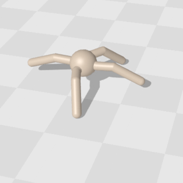
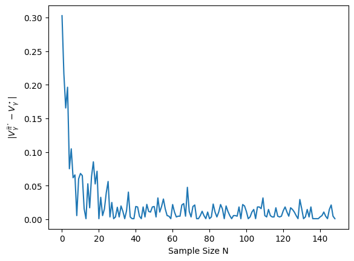

# 強化学習講義 第5回

モデルをサンプル近似する強化学習

コード：TODO

用語・表記：[メインスライド](https://syuntoku14.github.io/Foundations-of-RL)を参照

<!--
ほげほげ
-->

---
maxDepth: 1
layout: default
---

<Toc />


---
hideInToc: true
---

## これまでの復習：プランニングアルゴリズム

<br>

<div style="border: 2px solid #000; padding-top: 1px; padding-left: 10px; margin-top: 5px;">

MDPの情報が全部わかっている場合に$\pi^\star$を求める問題を**プランニング問題**と呼ぶ．\
つまり，$(\mathcal{S}, \mathcal{A}, P, r, \mu)$がわかっている場合に$\pi^\star$を**計算する**問題．

これまでの講義で，プランニング問題を解く様々なアルゴリズムを学んできた．\
価値反復法，方策反復法，方策勾配法，線型計画法…

</div>

<br>

<v-click>

<div style="border: 2px solid #000; padding-top: 1px; padding-left: 10px; margin-top: 5px; background-color: #ffffe0;">

しかし，現実の意思決定問題では$P$や$r$がわからないことが多い．

例：歪んだサイコロを振ってみよう．目が出る確率を厳密に近似できるだろうか？

**$P, r$がわからない場合** に$\pi^\star$を求める問題を**強化学習問題**と呼ぶ．

</div>

</v-click>

<span style="border: 2px solid #000; border-radius: 10px; padding: 5px 10px; background-color: #ffffe0; display: inline-block; position: absolute; top: 85%; left: 10%;">
プランニング問題
</span>

<Arrow x1="260" y1="490" x2="400" y2="490" />
<div style="position: absolute; top: 85%; left: 28%; text-align: center; font-size: 0.7em;">
サンプル近似（探索）
</div>

<span style="border: 2px solid #000; border-radius: 10px; padding: 5px 10px; background-color: #ffffe0; display: inline-block; position: absolute; top: 85%; left: 42%;">
強化学習
</span>

<Arrow x1="520" y1="490" x2="670" y2="490" />
<div style="position: absolute; top: 85%; left: 56%; text-align: center; font-size: 0.7em;">
関数近似 （深層）
</div>

<span style="border: 2px solid #000; border-radius: 10px; padding: 5px 10px; background-color: #ffffe0; display: inline-block; position: absolute; top: 85%; left: 70%;">
深層強化学習
</span>

---
hideInToc: true
---

## 今回の内容：シミュレータでの強化学習問題

<br>

**問題設定**

* 今回は簡単のために，$r$は既知だが，$P$がわからない場合を考える<sup>1</sup>．
* $(s, a)$が与えられると，次の状態$s'$を$P(\cdot \rvert s, a)$からサンプルするシミュレータがあるとする<sup>2</sup>．\
最近のシミュレータにはこの機能が備わっているものがある．（例：[Brax](https://github.com/google/brax) シミュレータ）
* 🤔 シミュレータでの最適方策$\pi^\star$を求めるにはどうすればよいだろうか？ 

<figure style="position: absolute; top: 3%; left: 80%; width: 130px; text-align: center;">
  
  <figcaption style="position: absolute; top: 100%; left: -10%; font-size: 0.8em; word-wrap: break-word; text-align: center; width: 130%">

  [Brax](https://github.com/google/brax)より引用．
  </figcaption>
</figure>

 ---

今回，$P$からサンプルはできるが，$P$の値はわからない．

😢 $P$がわからないので，今までのプランニングアルゴリズムは使えない．

👨‍🏫 これを解決する基本的な強化学習アルゴリズムを紹介するよ


<div style="font-size: 0.7em; text-align: left; position: absolute; bottom: 5px; left: 20px;">

[1] 一般に，$P$がわからない場合の方が難しい．$r$は$|\mathcal{S}||\mathcal{A}|$個しかパラメタがないが，$P$は$|\mathcal{S}|^2|\mathcal{A}|$個のパラメタがある．\
また，$r$は基本的にエンジニアが設計するので，既知な場合が多い．\
[2] このようなシミュレータを，強化学習の理論界隈では**Generative Model**と呼ぶ．
[Reinforcement Learning: Theory and Algorithms](https://rltheorybook.github.io/)など参照．

</div>

---
theme: default
highlighter: shiki
transition: slide-left
layout: section
class: 'text-center'
lineNumbers: true
colorSchema: light
---

# モデルベース強化学習

---

## モデルベース強化学習

これまで学んだアルゴリズム：$(\mathcal{S}, \mathcal{A}, P, r, \mu)$を受け取って$\pi^\star$を返す．今回，$P$はわからない．

そこで，シミュレータから集めたサンプルで $P$ を推定して，プランニングアルゴリズムを使おう．

👨‍🏫 このように，$P$を推定するアプローチ<sup>1</sup>を**モデルベース強化学習**と呼ぶ．

<div style="border: 2px solid #000; padding-top: 1px; padding-left: 10px; margin-top: 5px; background-color: #ffffe0;">

**モデルベース強化学習の概要**

1. 各$(s, a)\in \mathcal{S}\times\mathcal{A}$に対して，シミュレータから次状態$s'$を$N$個サンプルする．$(s'_1, s'_2, \ldots, s'_N)$
2. 集めたサンプルで遷移関数をモンテカルロ近似する：
$$
\widehat{P}(s' \rvert s, a) = \frac{1}{N} \sum_{i=1}^N \mathbb{I}[s'=s'_i]
$$
3. $(\mathcal{S}, \mathcal{A}, \widehat{P}, r, \mu)$を使って，プランニングアルゴリズムを実行する．出力された方策$\widehat{\pi}^\star$を返す．

</div>

<div style="font-size: 0.7em; text-align: left; position: absolute; bottom: 5px; left: 20px;">

[1] もしくは$P$に相当する何らかの情報．例えば最近の「世界モデル」などは，次に来る画像を推定するモデルを構築することがある．

</div>

---

## 実装：モデルベース強化学習

<br>

```python
from itertools import product
from copy import deepcopy

def model_based_rl(mdp: MDP, N: int):
    """モデルベース強化学習アルゴリズムの実装．簡単のためにmdp.Pも受け取っているが，これは未知だと思ってほしい．"""
    P_hat = np.zeros((mdp.S, mdp.A, mdp.S))  # Pの推定値の初期化

    for (s, a) in product(range(mdp.S), range(mdp.A)):
        next_states = np.random.choice(mdp.S, p=mdp.P[s, a], size=N)  # MDPの遷移確率から次状態をN個サンプル
        P_hat_sa = np.bincount(next_states, minlength=mdp.S) / N
        P_hat[s, a] = P_hat_sa  # モンテカルロ近似した遷移確率を保存

    mdp_hat = deepcopy(mdp)
    mdp_hat.P = P_hat  # 推定値を使ったMDPを作成
    Q_hat, pol_hat = value_iteration_q(mdp_hat, 1e-4)  # 価値反復法でQ値と貪欲方策を計算．第３回を参照
        
    return Q_hat, pol_hat

```

<br>

🤔 $N$を増やせば$\widehat{P}\approx P$になりそう．$\widehat{P} \approx P$ならば，$\widehat{\pi}^\star$が最適方策に近いことも期待できる？

---

## モデルベース強化学習の性能証明 ①

$\widehat{P} \approx P$のとき，本当に$\widehat{\pi}^\star$は最適方策になるだろうか？実は次が成立する：

<div style="border: 2px solid #000; padding-top: 1px; padding-left: 10px; margin-top: 5px; background-color: rgb(220, 241, 255);">

**命題（近似した行動価値関数の性能保証）**
２つのMDP $M \triangleq (\mathcal{S}, \mathcal{A}, P, r)$と$\widehat{M} \triangleq (\mathcal{S}, \mathcal{A}, \widehat{P}, r)$に対して，最適価値関数をそれぞれ$Q^\star_\gamma, V^\star_\gamma$と$\widehat{Q}^\star_\gamma, \widehat{V}^\star_\gamma$とする．このとき，次が成り立つ：

$$
\|Q^\star_\gamma - \widehat{Q}^\star_\gamma\|_\infty \leq \frac{\gamma}{1-\gamma}\| (P - \widehat{P}) V^\star_\gamma\|_\infty
$$

👨‍🏫 つまり，$P \approx \widehat{P}$ならば，右辺がほぼ$0$になって，$Q^\star_\gamma \approx \widehat{Q}^\star_\gamma$が言えるよ．

</div>

👨‍🏫 $\widehat{Q}^\star_\gamma$が$Q^\star_\gamma$に近いので，$\widehat{Q}^\star_\gamma$の貪欲方策が最適方策に近いことも期待できそうだ．

とりあえず先に上の命題を証明しよう．


---

次の補題が便利．

<div style="border: 2px solid #000; padding-top: 1px; padding-left: 10px; margin-top: 5px; background-color: rgb(220, 241, 255);">

**シミュレーション補題**<sup>1</sup>： ２つのMDP $(\mathcal{S}, \mathcal{A}, P, r)$と$(\mathcal{S}, \mathcal{A}, \widehat{P}, r)$に対して，方策$\pi \in \Pi$の行動価値関数をそれぞれ$Q^\pi_\gamma$と$\widehat{Q}^\pi_\gamma$とする．
このとき，次が成り立つ：<sup>2</sup>

$$
Q^\pi_\gamma - \widehat{Q}^\pi_\gamma = \gamma(I - \gamma \widehat{\bar{P}}_\pi)^{-1} (P - \widehat{P}) V^\pi_\gamma
$$

</div>

**証明**

$$
\begin{aligned}
Q^\pi_\gamma - \widehat{Q}^\pi_\gamma 
&= (I - \gamma \bar{P}_\pi)^{-1} r - (I - \gamma \widehat{\bar{P}}_\pi)^{-1} r  \quad \text{（Q関数の逆行列表記）}\\
&= (I - \gamma \widehat{\bar{P}}_\pi)^{-1}\left((I - \gamma \widehat{\bar{P}}_\pi) - (I - \gamma P_\pi)\right)Q^\pi_\gamma \\
&= \gamma(I - \gamma \widehat{\bar{P}}_\pi)^{-1}\left(\bar{P}_\pi - \widehat{\bar{P}}_\pi\right)Q^\pi_\gamma 
= \gamma(I - \gamma \widehat{\bar{P}}_\pi)^{-1}\left(P- \widehat{\bar{P}}\right)V^\pi_\gamma 
\end{aligned}
$$

<div style="font-size: 0.7em; text-align: left; position: absolute; bottom: 5px; left: 20px;">

[1] [Reinforcement Learning: Theory and Algorithms](https://rltheorybook.github.io/)の補題2.2など．\
[2] $\bar{P}_\pi(s', a'\rvert s, a) = \pi(a'\rvert s') P(s', \rvert s, a)$とした． 第２回を思い出そう．

</div>

---

シミュレーション補題から，次の補題が成立する．

<div style="border: 2px solid #000; padding-top: 1px; padding-left: 10px; margin-top: 5px; background-color: rgb(220, 241, 255);">

**$Q^\star$と$\widehat{Q}^\star$の差**： ２つのMDP $M \triangleq (\mathcal{S}, \mathcal{A}, P, r)$と$\widehat{M} \triangleq (\mathcal{S}, \mathcal{A}, \widehat{P}, r)$に対して，最適価値関数をそれぞれ$Q^\star_\gamma, V^\star_\gamma$と$\widehat{Q}^\star_\gamma, \widehat{V}^\star_\gamma$とする．また，それぞれの最適方策を$\pi^\star$と$\widehat{\pi}^\star$とする．
このとき，次が成り立つ：

$$
\begin{aligned}
Q^{\star}_\gamma-\widehat{Q}^{\star}_\gamma & \leq \gamma\left(I-\gamma \widehat{\bar{P}}_{\pi^{\star}}\right)^{-1}(P-\widehat{P}) V^{\star}_\gamma \\
Q^{\star}_\gamma-\widehat{Q}^{\star}_\gamma & \geq \gamma\left(I-\gamma \widehat{\bar{P}}_{\widehat{\pi}^{\star}}\right)^{-1}(P-\widehat{P}) V^{\star}_\gamma
\end{aligned}
$$

</div>

**証明** １つ目の不等式を示そう．シミュレーション補題から，次が成り立つ．

$$
Q^{\star}_\gamma-\widehat{Q}^{\star}_\gamma=Q_\gamma^{\pi^{\star}}-\widehat{Q}_\gamma^{\widehat{\pi}^{\star}} \leq Q_\gamma^{\pi^{\star}}-\widehat{Q}_\gamma^{\pi^{\star}}=\gamma\left(I-\gamma \widehat{\bar{P}}_{\pi^{\star}}\right)^{-1}(P-\widehat{\bar{P}}) V^{\star}_\gamma
$$

---

２つ目を示そう．シミュレーション補題の変形を応用する．

$$
\begin{aligned}
Q_\gamma^{\star}-\widehat{Q}_\gamma^{\star} & =Q_\gamma^{\pi^{\star}}-\widehat{Q}_\gamma^{\widehat{\pi}^{\star}} \\
& =(1-\gamma)\left(\left(I-\gamma \bar{P}_{\pi^{\star}}\right)^{-1} r-\left(I-\gamma \widehat{\bar{P}}_{\widehat{\pi}^{\star}}\right)^{-1} r\right) \\
& =\left(I-\gamma \widehat{\bar{P}}_{\pi^{\star}}\right)^{-1}\left(\left(I-\gamma \widehat{\bar{P}}_{\widehat{\pi}^{\star}}\right)-\left(I-\gamma \bar{P}_{\pi^{\star}}\right)\right) Q_\gamma^{\star} \\
& =\gamma\left(I-\gamma \widehat{\bar{P}}_{\pi^{\star}}\right)^{-1}\left(\bar{P}_{\pi^{\star}}-\widehat{\bar{P}}_{\widehat{\pi}^{\star}}\right) Q_\gamma^{\star}
\end{aligned}
$$

ここで，$\pi^\star$の$M$での最適性から，$\widehat{\bar{P}}_{\widehat{\pi}^{\star}}Q^\star_\gamma \leq \widehat{\bar{P}}_{\pi^{\star}}Q^\star_\gamma$が成り立つので，

$$
\begin{aligned}
& \geq \gamma\left(I-\gamma \widehat{\bar{P}}_{\pi^{\star}}\right)^{-1}\left(\bar{P}_{\pi^{\star}}-\widehat{\bar{P}}_{\pi^{\star}}\right) Q_\gamma^{\star}\\
& =\gamma\left(I-\gamma \widehat{\bar{P}}_{\pi^{\star}}\right)^{-1}(P-\widehat{\bar{P}}) V^{\star},
\end{aligned}
$$

が成立する．証明おわり．

---

また，次の補題も便利．

<div style="border: 2px solid #000; padding-top: 1px; padding-left: 10px; margin-top: 5px; background-color: rgb(220, 241, 255);">

**$(I-\gamma \bar{P}_\pi)^{-1} v$のバウンド**： 任意の$v \in \mathbb{R}^{|\mathcal{S}|}$と$\pi$について，
$\| (I - \gamma \bar{P}_\pi)^{-1} v \|_\infty \leq \frac{1}{1 - \gamma} \|v\|_\infty$．

</div> 

**証明** $v = (I - \gamma \bar{P}_\pi)^{-1} (I - \gamma \bar{P}_\pi) v = (I - \gamma \bar{P}_\pi) w$である．ここで，$w= (I - \gamma \bar{P}_\pi)^{-1} v$とする．\
三角不等式から，

$$
\|v\|_\infty = \|(I - \gamma \bar{P}_\pi) w\|_\infty \geq \|w\|_\infty - \gamma \|\bar{P}_\pi w\|_\infty 
$$

ここで，$\bar{P}_\pi$は確率行列なので，$\|\bar{P}_\pi w\|_\infty \leq \|w\|_\infty$が成り立つ．よって，

$$
\|v\|_\infty \geq \|w\|_\infty - \gamma \|w\|_\infty = (1 - \gamma) \|w\|_\infty
$$

あとは変形して証明終わり．

---

本題に戻ろう．\
「**$Q^\star$と$\widehat{Q}^\star$の差**」 と 「**$(I-\gamma \bar{P}_\pi)^{-1} v$のバウンド**」を組み合わせると，

$$
\|Q^\star_\gamma - \widehat{Q}^\star_\gamma\|_\infty \leq \frac{\gamma}{1-\gamma}\| (P - \widehat{P}) V^\star_\gamma\|_\infty
$$

が成立する．
これで「命題（近似した行動価値関数の性能保証）」が証明できた．

---

## モデルベース強化学習の性能証明 ②

最後に，$Q \approx Q^\star_\gamma$ならば，その$Q$関数の貪欲方策はほぼ最適方策になることを示そう．

<div style="border: 2px solid #000; padding-top: 1px; padding-left: 10px; margin-top: 5px; background-color: rgb(220, 241, 255);">

**命題（Q関数の誤差増幅）** 任意の関数 $Q \in \R^{|\mathcal{S}|\times |\mathcal{A}|}$について，その貪欲方策を$\pi_Q$とすると，次が成立：

$$
V^{\pi_Q}_\gamma \geq V^\star_\gamma - \frac{2\|Q - Q^\star_\gamma\|_\infty}{1 - \gamma} \boldsymbol{1}
$$

</div>

**証明** $a \in \argmax_{a'} Q$と略記する．このとき，

$$
\begin{aligned}
V^\star_\gamma - V^{\pi_Q}_\gamma 
= & V^\star_\gamma -Q_\gamma^{\pi_Q}(s, a) \\
= & V^\star_\gamma -Q_\gamma^{\star}(s, a)+Q_\gamma^{\star}(s, a)-Q_\gamma^{\pi_Q}(s, a) \\
= & V^\star_\gamma -Q_\gamma^{\star}(s, a)+\gamma \mathbb{E}_{s^{\prime} \sim P(\cdot \mid s, a)}\left[V^{\star}_\gamma\left(s^{\prime}\right)-V^{\pi_Q}_\gamma\left(s^{\prime}\right)\right] \\
\end{aligned}
$$

---

ここで，$a$の定義から$-Q\left(s, \pi^{\star}(s)\right)+Q(s, a) \geq 0$が成り立つので，さらに上からバウンドして：

$$
\begin{aligned}
V^\star_\gamma - V^{\pi_Q}_\gamma 
\leq & Q_\gamma^{\star}\left(s, \pi^{\star}(s)\right)-Q\left(s, \pi^{\star}(s)\right)+Q(s, a)-Q_\gamma^{\star}(s, a) +\gamma \mathbb{E}_{s^{\prime} \sim P(s, a)}\left[V^{\star}\left(s^{\prime}\right)-V^{\pi_Q}\left(s^{\prime}\right)\right] \\
\leq & 2\left\|Q-Q_\gamma^{\star}\right\|_{\infty}+\gamma\left\|V^{\star}_\gamma-V^{\pi_Q}_\gamma\right\|_{\infty} .
\end{aligned}
$$

あとは変形して証明終わり．


---

以上をまとめよう．MDP $\widehat{M} \triangleq (\mathcal{S}, \mathcal{A}, \widehat{P}, r)$について，その最適行動価値関数を$\widehat{Q}^\star_\gamma$とすると，

$$
\|Q^\star_\gamma - \widehat{Q}^\star_\gamma\|_\infty \leq \frac{\gamma}{1-\gamma}\| (P - \widehat{P}) V^\star_\gamma\|_\infty
$$

が成り立つ．さらに，$\widehat{Q}^\star_\gamma$の貪欲方策を$\widehat{\pi}^\star$とすると，

$$
V^{\widehat{\pi}^\star}_\gamma 
\geq V^\star_\gamma - \frac{2\|\widehat{Q}^\star_\gamma - Q^\star_\gamma\|_\infty}{1 - \gamma} \boldsymbol{1}
\geq V^\star_\gamma - \frac{2\gamma \| (P - \widehat{P}) V^\star_\gamma\|_\infty}{(1 - \gamma)^2} \boldsymbol{1}
$$

<div style="border: 2px solid #000; padding-top: 1px; padding-left: 10px; margin-top: 5px; background-color: #ffffe0;">

つまり，$P\approx \widehat{P}$ならば，

$$
V^{\widehat{\pi}^\star}_\gamma 
\geq V^\star_\gamma -[十分小さい定数]
$$

の意味で，$\widehat{\pi}^\star$は近似最適方策になる．

</div>

$N$を増やして$\| (P - \widehat{P}) V^\star_\gamma\|_\infty$が小さくなれば，$V^{\widehat{\pi}^\star}_\gamma \approx V^\star_\gamma$が成り立ちそう．

🤔 どれくらいのサンプル$N$を取ればよい？

---

## モデルベース強化学習の性能証明 ③

次の不等式を利用すると，必要なサンプル数$N$についての下限が求まる．

<div style="border: 2px solid #000; padding-top: 1px; padding-left: 10px; margin-top: 5px; background-color: rgb(220, 241, 255);">

**Hoeffdingの不等式**<sup>1</sup>：確率変数$X_1, X_2, \ldots, X_N$が独立かつ有界で，その値が$a \leq X_i \leq b$で収まっているとする．
このとき，$\mu_n = \frac{1}{N} \sum^{N}_{i=1} X_i$について，

$$
\mathbb{P}\left(|\mu_N - \mathbb{E}[\mu_N]| > \epsilon\right) \leq 2\exp\left(-\frac{ 2 N \epsilon^2}{(b - a)^2}\right) 
$$

変形すると，確率$1-\delta$以上で次が成り立つ：

$$
|\mu_N - \mathbb{E}[\mu_N]| \leq \sqrt{\frac{(b - a)^2}{2 N} \log\left(\frac{2}{\delta}\right)}
$$

</div>

<div style="font-size: 0.7em; text-align: left; position: absolute; bottom: 5px; left: 20px;">

[1] 証明は省略する．[Hoeffding's inequalityのwiki](https://en.wikipedia.org/wiki/Hoeffding%27s_inequality)など参照．

</div>

👨‍🏫 つまり，$N \propto \varepsilon^{-2}$のオーダーのサンプルがあれば，高確率で$|\mu_N - \mathbb{E}[\mu_N]| \leq \varepsilon$が言える．

---

Hoeffdingの不等式を使って，$\| (P - \widehat{P}) V^\star_\gamma\|_\infty$が十分小さくなることを示そう．

報酬が$[0, 1]$の範囲に収まると仮定すると，$V^\star_\gamma$は$[0, \frac{1}{1-\gamma}]$の範囲に収まる．\
よって，ある$(s, a)$に注目してHoeffdingの不等式を使うと，確率$1-\delta$以上で次が成り立つ：

$$
\begin{aligned}
\left| (P(\cdot \rvert s, a) - \widehat{P}(\cdot \rvert s, a))V^\star_\gamma\right|
= \left| \mathbb{E}_{s'\sim P(\cdot \rvert s, a)} [V^\star_\gamma(s')] - \frac{1}{N}\sum^N_{i=1}V^\star_\gamma(s'_i)\right|
\leq \frac{1}{1-\gamma}\sqrt{\frac{ \log (2\delta^{-1})}{2N}}\tag{1}
\end{aligned}
$$

本当に知りたいのは次の不等式であることに注意しよう．
$$
\| (P - \widehat{P}) V^\star_\gamma\|_\infty
= \max_{s, a} \left| \mathbb{E}_{s'\sim P(\cdot \rvert s, a)} [V^\star_\gamma(s')]  - \mathbb{E}_{s'\sim \widehat{P}(\cdot \rvert s, a)} [V^\star_\gamma(s')]\right| \tag{2}
$$

確率$(1-\delta)$以上で適当な$(s, a)$について式(1)が成り立つからと言って，式(2)が成り立つわけではない．

---


式(1)から式(2)をバウンドするために，「Union Bound」を使おう．

<div style="border: 2px solid #000; padding-top: 1px; padding-left: 10px; margin-top: 5px; background-color: rgb(220, 241, 255);">

**Union Bound**<sup>1</sup>：事象$A_1, A_2, \ldots, A_n$に対して，次が成り立つ：

$$
\mathbb{P}\left(A_1 \cup A_2 \cup \ldots \cup A_n\right) \leq \mathbb{P}(A_1) + \mathbb{P}(A_2) + \ldots + \mathbb{P}(A_n)
$$

</div>


👨‍🏫 簡単な例で確認するよ．

* ４月のあるn日目で電車が遅延する事象を$A_n$とする．
* 遅延する確率が$0.01$以下だとしよう．つまり，$\mathbb{P}(A_n) \leq 0.01$．
* この電車が一ヶ月内のどれか一日でも遅延する確率は，$\mathbb{P}(A_1 \cup A_2 \cup \ldots \cup A_{30})$である．
これは

$$
\mathbb{P}(A_1 \cup A_2 \cup \ldots \cup A_{30}) \leq \mathbb{P}(A_1) + \mathbb{P}(A_2) + \ldots + \mathbb{P}(A_{30}) \leq 30 \times 0.01 = 0.3
$$

で上からバウンドできる．つまり，30日間のうちに電車が遅延する確率は$0.3$以下である．

<div style="font-size: 0.7em; text-align: left; position: absolute; bottom: 5px; left: 20px;">

[1] ブールの不等式とも呼ばれる．[ブールの不等式の証明と応用例](https://manabitimes.jp/math/1252)など参照．

</div>

---

Union boundを使うと，任意の$(s, a) \in \mathcal{S}\times\mathcal{A}$に対して，確率$1 - |\mathcal{S}||\mathcal{A}|\delta$以上で次が成り立つ：

$$
\begin{aligned}
\left| (P(\cdot \rvert s, a) - \widehat{P}(\cdot \rvert s, a))V^\star_\gamma\right|
= \left| \mathbb{E}_{s'\sim P(\cdot \rvert s, a)} [V^\star_\gamma(s')] - \frac{1}{N}\sum^N_{i=1}V^\star_\gamma(s'_i)\right|
\leq \frac{1}{1-\gamma}\sqrt{\frac{ \log (2\delta^{-1})}{2N}}
\end{aligned}
$$

$|\mathcal{S}||\mathcal{A}|\delta$を改めて$\delta$と置いて変形すると，次の不等式が確率$1 - \delta$以上で成り立つ：

$$
\| (P - \widehat{P}) V^\star_\gamma\|_\infty
= \max_{s, a} \left| \mathbb{E}_{s'\sim P(\cdot \rvert s, a)} [V^\star_\gamma(s')]  - \mathbb{E}_{s'\sim \widehat{P}(\cdot \rvert s, a)} [V^\star_\gamma(s')]\right|
\leq \frac{1}{1-\gamma}\sqrt{\frac{ \log (2|\mathcal{S}||\mathcal{A}|\delta^{-1})}{2N}}
$$

<div style="border: 2px solid #000; padding-top: 1px; padding-left: 10px; margin-top: 5px; background-color: #ffffe0;">

これまでの結果をまとめると，確率$1 - \delta$以上で次が成り立つ：


$$
V^{\widehat{\pi}^\star}_\gamma 
\geq V^\star_\gamma - \frac{2\gamma \| (P - \widehat{P}) V^\star_\gamma\|_\infty}{(1 - \gamma)^2} \boldsymbol{1}
\geq V^\star_\gamma - \frac{2\gamma}{(1 - \gamma)^3} \sqrt{\frac{ \log (2|\mathcal{S}||\mathcal{A}|\delta^{-1})}{2N}} \boldsymbol{1}
$$

👨‍🏫 よって，十分大きい$N$で二項目が０に近づき，$\widehat{\pi}^\star$がほぼ最適方策であることが分かる．

</div>

---

## 実装：モデルベース強化学習とサンプル数$N$の関係

実際にサンプル数$N$が大きくなると性能が上がるか見てみよう．

```python

import matplotlib.pyplot as plt

Q_star, _ = value_iteration_q(mdp, 1e-4) 
V_star = np.max(Q_star, axis=1)  # 真の最適価値関数

V_gaps = []  # 最適価値関数とのギャップを保存するリスト

for N in range(1, 150):
    _, pol_hat = model_based_rl(mdp, N)
    V_pol_hat = evaluate_policy(mdp, pol_hat)  # 第２回を思い出して実装しよう．

    V_gap = np.max(np.abs(V_star - V_pol_hat))  # 最適価値関数とのギャップ
    V_gaps.append(V_gap)

plt.plot(V_gaps)
plt.xlabel('Sample Size N')
plt.ylabel(r'$|V^{\widehat{\pi}^\star}_\gamma - V^\star_\gamma|$')
```

<figure style="position: absolute; top: 30%; left: 70%; width: 250px; text-align: center;">
  
  <figcaption style="font-size: 0.8em; word-wrap: break-word; text-align: center;">

  👨‍🏫 こんな感じの図が出力されるはず．
  $V^{\widehat{\pi}^\star}_\gamma$が$V^\star_\gamma$に収束している．

  </figcaption>
</figure>

