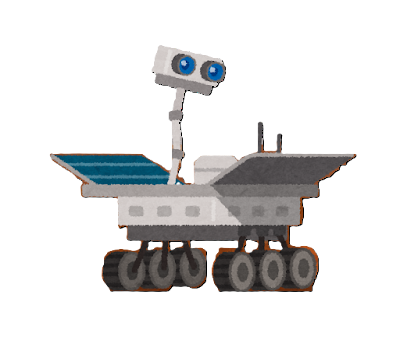
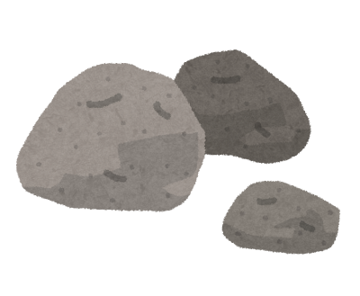
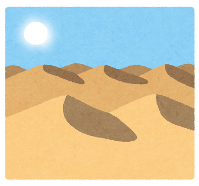

# 強化学習講義 第五回

確率論の道具と集中不等式

<!--
ほげほげ
-->

---
maxDepth: 1
layout: default
---

<Toc />

---
hideInToc: true
---

## これまでの復習：プランニングアルゴリズム

 

MDPの情報が全部わかっている場合に$\pi^\star$を求める問題を**プランニング問題**と呼ぶ．\
つまり，$(\mathcal{S}, \mathcal{A}, P, r, \mu)$がわかっている場合に$\pi^\star$を**計算する**問題．

これまでの講義で，プランニング問題を解く様々なアルゴリズムを学んできた．\
価値反復法，方策反復法，方策勾配法，線型計画法…

<v-click>

しかし，現実の意思決定問題では$P$や$r$がわからないことが多い．

例：歪んだサイコロを振ってみよう．目が出る確率は最初わからない．何度も振ってみて，どの目が出やすいかを推定する必要がある．

**$P, r$がわからない場合** に$\pi^\star$を求める問題を**強化学習問題**と呼ぶ．

</v-click>

プランニング問題

<Arrow x1="260" y1="490" x2="400" y2="490" />

サンプル近似（探索）

強化学習

<Arrow x1="520" y1="490" x2="670" y2="490" />

関数近似 （深層）

深層強化学習

---
hideInToc: true
---

## これからの内容：サンプルでMDPを推定する

 

* サイコロの目が知りたいならば，何度も振ってみて，どの目が出やすいかを推定すれば良い．
* 同様に遷移確率$P$や報酬関数$r$も推定できる？
* 🤔 何度も環境を動き回れば，集めたサンプルから推定できそう．

<figure style="position: absolute; bottom: 150px; left: 80px; width: 130px; text-align: center;">
  
  <figcaption style="text-align: center; position: absolute; top: -20px; left: 10px;">エージェント</figcaption>
  <figcaption style="text-align: center; position: absolute; bottom: -30px; left: 0px; width: 150px; font-size: 0.8em;"> 
  
  初期状態 $s_1 \sim \mu$ 
  </figcaption>
</figure>

<Arrow x1="200" y1="350" x2="400" y2="310" />

  行動 $a_1 \sim \pi(\cdot \mid s_1)$\
  報酬 $r_1 = r(s_1, a_1)$

<figure style="position: absolute; bottom: 230px; left: 400px; width: 100px; text-align: center;">
  
  
  <figcaption style="position: absolute; top: 70px; left: -70px; width: 300px; text-align: center; font-size: 0.8em;">
  
  状態 $s_2 \sim P(\cdot \mid s_1, a_1)$ 
  </figcaption>
</figure>

<Arrow x1="540" y1="310" x2="740" y2="350" />

  行動 $a_2 \sim \pi(\cdot \mid s_2)$\
  報酬 $r_2 = r(s_2, a_2)$

<figure style="position: absolute; bottom: 150px; left: 750px; width: 80px; text-align: center;">
  
  
  <figcaption style="position: absolute; top: 60px; left: -20px; width: 180px; text-align: center;font-size: 0.8em;">
  
  状態 $s_3 \sim P(\cdot \mid s_2, a_2)$ 
  </figcaption>
</figure>
<Arrow x1="880" y1="370" x2="1040" y2="300" />

これからは「集めたサンプルで何かを推定する」ことを考える．「何か」$\approx$ 「MDPや価値関数など」\
サンプルの数から方策の性能を保証するために，確率論の道具を使う．

---
src: ./slides-central-limit-theorem.md
---
