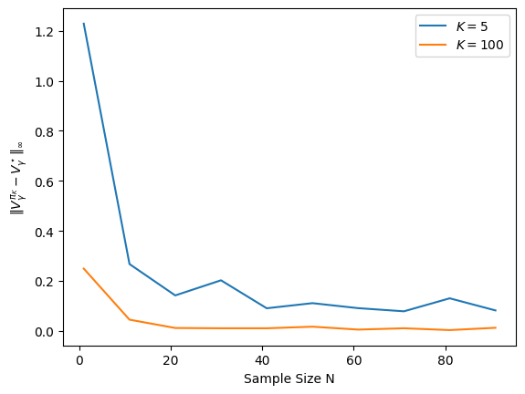

# モデルフリー強化学習

---

## モデルフリー強化学習

<br>

モデルベース強化学習では$P$を推定した．

これは$|\mathcal{S}|^2|\mathcal{A}|$個のパラメタを推定しないといけないので，メモリ効率が悪い．

また，$P$を推定する ≒ 「現実の環境をシミュレートする」だが，一部の意思決定問題は環境全てをシミュレートする必要がない．
例えば玉ねぎを切る時，頭の中で玉ねぎの物理現象を細かく考える必要はないだろう．

そこで，**モデルフリー強化学習**では$P$を推定せずに$\pi^\star$を求める<sup>1</sup>．


<div style="font-size: 0.7em; text-align: left; position: absolute; bottom: 5px; left: 20px;">

[1] モデルフリーとモデルベースの違いは曖昧で，文献によって異なる．テーブルMDPならば一般に「$|\mathcal{S}|^2|\mathcal{A}|$サイズのメモリを消費するアルゴリズムはモデルベース」である．モデルフリーは「$|\mathcal{S}||\mathcal{A}|$」しか使わない．関数近似がある場合については以下の文献を参照してほしい：\
[Model-based RL in Contextual Decision Processes](https://arxiv.org/abs/1811.08540)

</div>

---

## 価値反復法のサンプル近似

プランニングアルゴリズムの価値反復法（Q版）を思い出そう．

$$
Q_{k+1}(s, a) \triangleq r(s, a) + \gamma \underbrace{\sum_{s' \in \mathcal{S} }P(s' \rvert s, a) \max_{a'} Q_k(s', a')}_{\text{ここを近似する}} \tag{1}
$$

今回は$P$がわからない．そこで，シミュレータから$s'$をサンプルして，二項目をモンテカルロ近似しよう．

<div style="border: 2px solid #000; padding-top: 1px; padding-left: 10px; margin-top: 5px; background-color: #ffffe0;">

**モデルフリー強化学習の概要**： $Q_0=\boldsymbol{0}$で初期化する．各イテレーション$k$で，
1. 各$(s, a)\in \mathcal{S}\times\mathcal{A}$に対して，シミュレータから次状態$s'$を$N$個サンプルする．$(s'_1, s'_2, \ldots, s'_N)$
2. 集めたサンプルで式(1)の二項目を近似する．
$$
\widehat{V}_k(s') \triangleq \frac{1}{N}\sum_{i=1}^N \max_{a'} Q_k(s'_i, a')
$$
3. 価値関数を$Q_{k+1}(s, a) = r(s, a) + \gamma \widehat{V}_k(s')$で更新する．

</div>

---

## 実装：モデルフリー強化学習

<br>

```python

def compute_greedy_policy(Q: np.ndarray):
  S, A = Q.shape
  greedy_policy = np.zeros_like(Q)
  greedy_policy[np.arange(S), np.argmax(Q, axis=1)] = 1.0  # Q値が最も大きい行動を選ぶ確率を1にする
  return greedy_policy

def model_free_rl(mdp: MDP, N: int, K: int = 1000):
    """モデルフリー強化学習アルゴリズムの実装．簡単のためにmdp.Pも受け取っているが，これは未知だと思ってほしい．"""
    q = np.zeros((mdp.S, mdp.A))  # 初期価値関数
    for k in range(K):
        for (s, a) in product(range(mdp.S), range(mdp.A)):
            next_states = np.random.choice(mdp.S, p=mdp.P[s, a], size=N)  # MDPの遷移確率から次状態をN個サンプル
            v = q.max(axis=1)
            next_v = v[next_states].mean()  # サンプルした次状態の価値の平均
            q[s, a] = mdp.r[s, a] + mdp.gamma * next_v  # Q関数の更新

    pol = compute_greedy_policy(q)  # 貪欲方策の計算
    return pol
```

🤔 ``model_based_rl``では``P=np.zeros((mdp.S, mdp.A, mdp.S))``を更新していたことを思い出そう．\
今回は``Q=np.zeros((mdp.S, mdp.A))``の変数しか使っていない．

---

## モデルフリー強化学習の性能証明

実装したアルゴリズムは価値反復法に近似誤差$\epsilon_{k+1} \in \R^{\mathcal{S}\times \mathcal{A}}$が乗った形とみなせる：

$$
\begin{cases}
\pi_{k+1} & \triangleq Q_k\text{の貪欲方策}\\
Q_{k+1} & \triangleq T_{\pi_{k+1}} Q_k + \epsilon_{k+1}
\end{cases}
$$

ここで$T_{\pi_{k+1}}$はベルマン期待作用素（第2回を思い出そう）．

<div style="border: 2px solid #000; padding-top: 1px; padding-left: 10px; margin-top: 5px;">

🤔 サンプル数$N$が増えると$\epsilon_{k+1}$は小さくなる．これはモンテカルロ近似そのものなので，証明は省略<sup>1</sup>
$$
\frac{1}{N}\sum_{i=1}^N \max_{a'} Q_k(s'_i, a')  \approx \sum_{s'} P(s' \rvert s, a) \max_{a'} Q_k(s', a')
$$

</div>

<div style="border: 2px solid #000; padding-top: 1px; padding-left: 10px; margin-top: 5px; background-color: #ffffe0;">

$Q_k$の更新で生じた誤差$\epsilon_k$は$Q_{k+1}$に残り，$Q_{k+2}$に残り，$\ldots$と伝播していく．

🤔 $|\epsilon_k| \leq \epsilon$としよう．どれくらい誤差$\epsilon$が小さくなれば，$\pi_K$は最適方策に近くなるだろう？

</div>

<div style="font-size: 0.7em; text-align: left; position: absolute; bottom: -10px; left: 20px;">

[1] Hoeffdingの不等式と（Covering numberによる）Union boundを使う．ややこしいので省略する or 後日追記しておく．

</div>

---

## モデルフリー強化学習の性能証明：誤差伝搬解析


$\pi_k$と最適価値関数の差は次のように分解できる．任意の$s, a$について$Q^\star_\gamma \geq Q^{\pi_k}_\gamma$なので，
$$
\begin{aligned}
\|Q^\star_\gamma - Q^{\pi_k}_\gamma \|_\infty 
& = \max_{s, a} Q^\star_\gamma(s, a) - Q_k(s, a) + \epsilon_k(s, a) + Q_k(s, a) - \epsilon_k(s, a) - Q^\star_\gamma(s, a)\\
& = \max_{s, a} \underbrace{Q^\star_\gamma(s, a) - Q_k(s, a) + \epsilon_k(s, a)}_{\alpha_k(s, a) \text{と置く}} + 
\max_{s, a} \underbrace{Q_k(s, a) - \epsilon_k(s, a) - Q^\star_\gamma(s, a)}_{\beta_k(s, a) \text{と置く}}\\
\end{aligned}
$$

この１項目と２項目をそれぞれバウンドすることで，$\pi_k$の最適性を解析する．


<div style="font-size: 0.7em; text-align: left; position: absolute; bottom: 5px; left: 20px;">

* 今回の誤差伝搬解析はこの文献に基づいている：https://inria.hal.science/inria-00480952v1/document

</div>

---
hideInToc: true
---

## $\alpha_k$のバウンド

まず$\alpha_k$をみてみよう．

$$
\begin{aligned}
\alpha_{k+1}
=& Q^\star_\gamma - (Q_{k+1} - \epsilon_{k+1})
= Q^\star_\gamma - T_{\pi_{k+1}}Q_{k} \quad &&\text{（$Q_{k+1} = T_{\pi_{k+1}} Q_k + \epsilon_{k+1}$を使った）}\\
=& Q^\star_\gamma - T_{\pi^\star}Q_{k} + \underbrace{T_{\pi^\star}Q_{k} - T_{\pi_{k+1}}Q_{k}}_{\leq 0} 
\quad &&\text{（$\pi_{k+1}$は$Q_{k}$の貪欲方策なので$\leq 0$が成立）}\\
\leq &T_{\pi^\star} Q^\star_\gamma - T_{\pi^\star}Q_{k} 
= \gamma \bar{P}_{\pi^\star} (Q^\star_\gamma - Q_{k}) \quad&& \text{（ベルマン作用素の定義）}^1\\
=& \gamma \bar{P}_{\pi^\star} \underbrace{(Q^\star_\gamma - (Q_{k} - \epsilon_k))}_{\alpha_k} - \gamma \bar{P}_{\pi^\star} \epsilon_k
\end{aligned}
$$

$\bar{P}_{\pi^\star}$は確率行列なので，$\sum_{s', a'} \bar{P}_{\pi^\star}(s', a' \rvert s, a) = 1$が各$(s, a)$で成り立つ．よって，

$$
\max_{s, a}\alpha_{k+1}(s, a) \leq \gamma \max_{s, a}\alpha_k(s, a) + \gamma \max_{s, a}|\epsilon_k(s, a)|
\leq \gamma \max_{s, a}\alpha_k(s, a) + \gamma \epsilon
$$

<div style="font-size: 0.7em; text-align: left; position: absolute; bottom: 5px; left: 20px;">

[1] 任意の$q_1, q_2$について，$T_{\pi} q_1 - T_{\pi}q_2 = \gamma \bar{P}_{\pi} (q_1 - q_2)$が成り立つ．確かめてほしい．

</div>

---
hideInToc: true
---

再帰的に$\max_{s, a}\alpha_k(s, a)$を変形すると，次のバウンドが得られる．

$$
\begin{aligned}
\max_{s, a}\alpha_{k}(s, a) 
&\leq \gamma \max_{s, a}\alpha_{k-1}(s, a) + \gamma \epsilon
\leq \gamma^2 \max_{s, a}\alpha_{k-2}(s, a) + (\gamma+\gamma^2) \epsilon \\
&\leq \dots 
\leq \gamma^k \max_{s, a}\alpha_0(s, a) + \frac{\gamma}{1-\gamma} \epsilon
\end{aligned}
$$

ここで，$Q_0$を０で初期化して，かつ報酬が$\|r\|_\infty \leq 1$のとき，$\alpha_0 = Q^\star_\gamma - \underbrace{Q_{0}}_{=0} - \underbrace{\epsilon_{0}}_{=0} \leq 1 / (1-\gamma)$が成り立つ．
よって，

$$
\begin{aligned}
\max_{s, a}\alpha_{k}(s, a) \leq \frac{\gamma^k}{1-\gamma} + \frac{\gamma}{1-\gamma} \epsilon
\end{aligned}
$$

<!-- \quad \text{（）} -->

---
hideInToc: true
---

## $\beta_k$のバウンド

続いて$\beta_k$をバウンドする．

$$
\begin{aligned}
\beta_{k+1} 
&= Q_{k+1} - \epsilon_{k+1} - Q^{\pi_{k+1}}_\gamma \\
&= T_{\pi_{k+1}} Q_{k} - T_{\pi_{k+1}}^\infty Q_k \\
&= T_{\pi_{k+1}} Q_{k} - T_{\pi_{k+1}}^2 Q_k + T_{\pi_{k+1}}^2 Q_k - T_{\pi_{k+1}}^3 Q_k  + \ldots\\
&= (\gamma \bar{P}_{\pi_{k+1}}) (Q_k - T_{\pi_{k+1}} Q_k) + (\gamma \bar{P}_{\pi_{k+1}})^2 (Q_k - T_{\pi_{k+1}} Q_k) + \ldots\\
&= (\gamma \bar{P}_{\pi_{k+1}}) \left(I + \gamma \bar{P}_{\pi_{k+1}} + \gamma^2 \bar{P}_{\pi_{k+1}}^2 + \ldots \right)
(Q_k - T_{\pi_{k+1}} Q_k)
\end{aligned}
$$

ここで，$\bar{P}_{\pi_{k+1}}$は確率行列なので，

$$
\begin{aligned}
\max_{s, a}\beta_{k+1}(s, a)
\leq \gamma(1 + \gamma + \gamma^2 + \ldots) \max_{s, a} (Q_k - T_{\pi_{k+1}} Q_k)(s, a)
= \frac{\gamma}{1-\gamma} \max_{s, a} \underbrace{(Q_k - T_{\pi_{k+1}} Q_k)(s, a)}_{c_k(s, a)\text{とおく}}\\
\end{aligned}
$$

🤔 最後に$c_k(s, a)$がどれくらい小さくなるか見てみよう．

---

$$
\begin{aligned}
c_k &= Q_k - T_{\pi_{k+1}} Q_k
= Q_k - T_{\pi_{k}} Q_k + \underbrace{T_{\pi_{k}} Q_k - T_{\pi_{k+1}} Q_k}_{\leq 0} \quad \text{（$\pi_{k+1}$は$Q_k$の貪欲方策なので$\leq 0$）} \\
&\leq Q_k - T_{\pi_{k}} Q_k 
= (Q_k - \epsilon_k + \epsilon_k) - T_{\pi_{k}} (Q_k - \epsilon_k + \epsilon_k)\\
&= (Q_k - \epsilon_k) - T_{\pi_{k}} (Q_k - \epsilon_k) + \epsilon_k - \gamma \bar{P}_{\pi_k} \epsilon_k \\
\end{aligned}
$$

最後の等式はベルマン作用素の定義に従って，次の変形を使った：

$$
\begin{aligned}
&T_{\pi_{k}} (Q_k - \epsilon_k + \epsilon_k)(s, a) \\
= &r(s, a) + \sum_{s', a'} \bar{P}_{\pi_k}(s', a' \rvert s, a) (Q_k(s', a') - \epsilon_k(s', a') + \epsilon_k(s', a'))\\
= &r(s, a) + \sum_{s', a'} \bar{P}_{\pi_k}(s', a' \rvert s, a) (Q_k(s', a') - \epsilon_k(s', a'))
 + \sum_{s', a'} \bar{P}_{\pi_k}(s', a' \rvert s, a) \epsilon_k(s', a') \\
\end{aligned}
$$

よって，

$$
\begin{aligned}
c_k 
= \underbrace{(Q_k - \epsilon_k)}_{T_{\pi_k} Q_{k-1}} - T_{\pi_{k}} \underbrace{(Q_k - \epsilon_k)}_{T_{\pi_k} Q_{k-1}} + \underbrace{\epsilon_k - \gamma \bar{P}_{\pi_k} \epsilon_k}_{I - \gamma\bar{P}_{\pi_k} \epsilon_k} 
= \gamma \bar{P}_{\pi_k} \underbrace{(Q_{k-1} - T_{\pi_k} Q_{k-1})}_{c_{k-1}} + I - \gamma \bar{P}_{\pi_k} \epsilon_k 
\end{aligned}
$$

---

$\bar{P}_{\pi_k}$は確率行列なので，$\max_{s, a}c_k(s, a)$は次のようにバウンドできる．

$$
\begin{aligned}
\max_{s, a}c_k(s, a)
\leq \gamma \max_{s, a} c_{k-1}(s, a) + (1+\gamma) \epsilon
\end{aligned}
$$

再帰的に$\max_{s, a}c_k(s, a)$を変形すると，次のバウンドが得られる．

$$
\begin{aligned}
\max_{s, a}c_k(s, a)
&\leq \gamma \max_{s, a} c_{k-1}(s, a) + (1+\gamma) \epsilon\\
&\leq \gamma^2 \max_{s, a} c_{k-2}(s, a) + (1+\gamma) (1 + \gamma) \epsilon
\leq \ldots\\
&\leq \gamma^k  \max_{s, a} c_{0}(s, a) + \frac{1+\gamma}{1-\gamma} \epsilon
\end{aligned}
$$

ここで，$c_0(s, a) = Q_0(s, a) - T_{\pi_q} Q_0(s, a) = -r(s, a)$なので，$|r(s, a)| \leq 1$ならば，

$$
\max_{s, a}c_k(s, a) \leq \gamma^k + \frac{1+\gamma}{1-\gamma} \epsilon
$$

---
hideInToc: true
---

<div style="border: 2px solid #000; padding-top: 1px; padding-left: 10px; margin-top: 5px; background-color: #ffffe0;">

よって，今までの結果を全部合体すると，

$$
\begin{aligned}
\|Q^\star_\gamma - Q^{\pi_k}_\gamma \|_\infty 
&\leq \underbrace{\max_{s, a} \alpha_k(s, a)}_{\leq \frac{\gamma^k}{1-\gamma} + \frac{\gamma}{1-\gamma}\epsilon} + \underbrace{\max_{s, a} \beta_k(s, a)}_{\frac{\gamma}{1-\gamma}\max_{s, a}c_k(s, a)}\\
& \leq 
\frac{\gamma^k}{1-\gamma} + \frac{\gamma}{1-\gamma}\epsilon
+ \frac{\gamma}{1-\gamma}\underbrace{\max_{s, a}c_k(s, a)}_{\leq \gamma^k + \frac{1+\gamma}{1-\gamma} \epsilon}\\
& \leq 
\underbrace{\frac{2\gamma^k}{1-\gamma}}_{価値反復法の収束} + \underbrace{\frac{\gamma}{1-\gamma}\epsilon + \frac{\gamma(1+\gamma)}{(1-\gamma)^2} \epsilon}_{誤差の伝搬}
\end{aligned}
$$

* 一項目は価値反復法自体の収束速度．イテレーション$k$を増やすと$0$に収束する．
* 二項目は近似によって生じた誤差．$\epsilon$が小さくなると，この項も小さくなる．\
（$N$が大きくなると$\epsilon$が小さくなる．）

</div>

---

## 実装：モデルフリー強化学習とサンプル数$N$の関係

実際にサンプル数$N$とイテレーション数$K$が大きくなると性能が上がるか見てみよう．

```python
import matplotlib.pyplot as plt

Q_star, _ = value_iteration_q(mdp, 1e-4)
V_star = np.max(Q_star, axis=1)  # 真の最適価値関数
for K in [5, 100]:
  V_gaps = []  # 最適価値関数とのギャップを保存するリスト
  samples = []

  for N in range(1, 100, 10):
      pol_hat = model_free_rl(mdp, N, K)
      V_pol_hat = evaluate_policy(mdp, pol_hat)
      V_gap = np.max(np.abs(V_star - V_pol_hat))  # 最適価値関数とのギャップ
      V_gaps.append(V_gap)
      samples.append(N)

  plt.plot(samples, V_gaps, label=r"$K=$"+str(K))

plt.xlabel('Sample Size N')
plt.ylabel(r'$\|V^{\pi_K}_\gamma - V^\star_\gamma\|_\infty$')
plt.legend()
```

<figure style="position: absolute; top: 40%; left: 69%; width: 250px; text-align: center;">
  
  <figcaption style="font-size: 0.8em; word-wrap: break-word; text-align: center; width: 120%;">

  👨‍🏫 こんな感じの図が出力されるはず．\
  $K$と$N$が大きいほうが最適方策に近い．

  </figcaption>
</figure>


